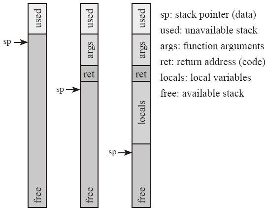

# 10.1 堆和栈

一个进程在执行的时候，它所占用的内存的虚拟地址空间一般被分割成好几个区域，我们称为“段”（Segment）。常见的几个段如下。

* 代码段。编译后的机器码存在的区域。一般这个段是只读的。

* bss 段。存放未初始化的全局变量和静态变量的区域。

* 数据段。存放有初始化的全局变量和静态变量的区域。

* 函数调用栈（call stack segment）。存放函数参数、局部变量以及其他函数调用相关信息的区域。

* 堆（heap）。存放动态分配内存的区域。

函数调用栈（call stack）也可以简称为栈（stack）。因为函数调用栈本来就是基于栈这样一个数据结构实现的。
它具备“后入先出”（LIFO）的特点。最先进入的数据也是最后出来的数据。一般来说，CPU 有专门的指令可以用于入栈或者出栈的操作。
当一个函数被调用时，就会有指令把当前指令的地址压入栈内保存起来，然后跳转到被调用的函数中执行。
函数返回的时候，就会把栈里面先前的指令地址弹出来继续执行，如图 10-1 所示。

堆是为动态分配预留的内存空间，如图 10-2 所示。和栈不一样，从堆上分配和重新分配块没有固定模式，用户可以在任何时候分配和释放它。
这样就使得跟踪哪部分堆已经被分配和被释放变得异常复杂；有许多定制的堆分配策略用来为不同的使用模式下调整堆的性能。堆是在内存中动态分配的内存，是无序的。每个线程都有一个栈，但是每一个应用程序通常都只有一个堆。在堆上的变量必须要手动释放，不存在作用域的问题。

一般来说，操作系统提供了在堆上分配和释放内存的系统调用，但是用户不是直接使用这个系统调用，而是使用封装的更好的“内存分配器”（Allocator）。比如，在 C 语言里面，运行时（runtime）就提供了 malloc 和 free 这两个函数可以管理堆内存。

堆和栈之间的区别有：

* 栈上保存的局部变量在退出当前作用域的时候会自动释放；

* 堆上分配的空间没有作用域，需要手动释放；

* 一般栈上分配的空间大小是编译阶段就可以确定的（C 语言里面的 VLA 除外）；

* 栈有一个确定的最大长度，超过了这个长度会产生“栈溢出”（stack overflow）；

* 堆的空间一般要更大一些，堆上的内存耗尽了，就会产生“内存分配不足”（out of memory）。

> 图源于 https://stackoverflow.com/questions/79923/what-and-where-are-the-stack-and-heap。
