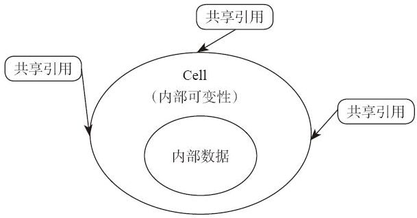

### 15.1 Cell

按照前面的理论，如果我们有共享引用指向一个对象，那么这个对象就不会被更改了。因为在共享引用存在的期间，不能有可变引用同时指向它，因此它一定是不可变的。其实在 Rust 中，这种想法是不准确的。下面给出一个示例：

---

```rust
use std::rc::Rc;

fn main() {
    let r1 = Rc::new(1);
    println!("reference count {}", Rc::strong_count(&r1));
    let r2 = r1.clone();
    println!("reference count {}", Rc::strong_count(&r2));
}
```

---

编译，执行，结果为：

---

```rust
reference count 1
reference count 2
```

---

Rc 是 Rust 里面的引用计数智能指针，在后文中我们还会继续讲解。多个 Rc 指针可以同时指向同一个对象，而且有一个共享的引用计数值在记录总共有多少个 Rc 指针指向这个对象。

注意 Rc 指针提供的是共享引用，按道理它没有修改共享数据的能力。但是我们用共享引用调用 clone 方法，引用计数值发生了变化。这就是我们要说的“内部可变性”。如果没有内部可变性，标准库中的 Rc 类型是无法正确实现出来的。具备内部可变性的类型，最典型的就是 Cell。

现在用一个更浅显的例子来演示一下 Cell 的能力：

---

```rust
use std::cell::Cell;

fn main() {
    let data : Cell<i32> = Cell::new(100);
    let p = &data;
    data.set(10);
    println!("{}", p.get());

    p.set(20);
    println!("{:?}", data);
}
```

---

这次编译通过，执行，结果是符合我们的预期的：

---

```rust
10
Cell { value: 20 }
```

---

请注意这个例子最重要的特点。需要注意的是，这里的“可变性”问题跟我们前面见到的情况不一样了。data 这个变量绑定没有用 mut 修饰，p 这个指针也没有用&mut 修饰，然而不可变引用竟然可以调用 set 函数，改变了变量的值，而且还没有出现编译错误。

这就是所谓的内部可变性——这种类型可以通过共享指针修改它内部的值。虽然粗略一看，Cell 类型似乎违反了 Rust 的“唯一修改权”原则。我们可以存在多个指向 Cell 类型的不可变引用，同时我们还能利用不可变引用改变 Cell 内部的值。但实际上，这个类型是完全符合“内存安全”的。我们再想想，为什么 Rust 要尽力避免 alias 和 mutation 同时存在？因为假如我们同时有可变指针和不可变指针指向同一块内存，有可能出现通过一个可变指针修改内存的过程中，数据结构处于被破坏状态的情况下，被其他的指针观测到。Cell 类型是不会出现这样的情况的。因为 Cell 类型把数据包裹在内部，用户无法获得指向内部状态的指针，这意味着每次方法调用都是执行的一次完整的数据移动操作。每次方法调用之后，Cell 类型的内部都处于一个正确的状态，我们不可能观察到数据被破坏掉的状态。

多个共享指针指向 Cell 类型的状态就类似图 15-1 所示的这样，Cell 就是一个“壳”，它把数据严严实实地包裹在里面，所有的指针只能指向 Cell，不能直接指向数据。修改数据只能通过 Cell 来完成，用户无法创造一个直接指向数据的指针。



图 15-1

我们来仔细观察一下 Cell 类型提供的公开的 API，就能理解 Cell 类型设计的意义了。下面是 Cell 类型提供的几个主要的成员方法：

---

```rust
impl<T> Cell<T> {

    pub fn get_mut(&mut self) -> &mut T {    }

    pub fn set(&self, val: T) {    }

    pub fn swap(&self, other: &Self) {    }

    pub fn replace(&self, val: T) -> T {    }

    pub fn into_inner(self) -> T {    }
}

impl<T:Copy> Cell<T> {

    pub fn get(&self) -> T {    }
}
```

---

* `get_mut`方法可以从`&mut Cell<T>`类型制造出一个`&mut T`型指针。因为`&mut`型指针具有“独占性”，所以这个函数保证了调用前，有且仅有一个“可写”指针指向 Cell，调用后有且仅有一个“可写”指针指向内部数据。它不存在制造多个引用指向内部数据的可能性。

* `set`方法可以修改内部数据。它是把内部数据整个替换掉，不存在多个引用指向内部数据的可能性。

* `swap`方法也是修改内部数据。跟`set`方法一样，也是把内部数据整体替换掉。与`std::mem::swap`函数的区别在于，它仅要求`&`引用，不要求`&mut`引用。

* `replace`方法也是修改内部数据。跟`set`方法一样，它也是把内部数据整体替换，唯一的区别是，换出来的数据作为返回值返回了。

* `into_inner`方法相当于把这个“壳”剥掉了。它接受的是 Self 类型，即 move 语义，原来的 Cell 类型的变量会被 move 进入这个方法，会把内部数据整体返回出来。

* `get`方法接受的是`&self`参数，返回的是 T 类型，它可以在保留之前 Cell 类型不变的情况下返回一个新的 T 类型变量，因此它要求`T：Copy`约束。每次调用它的时候，都相当于把内部数据 memcpy 了一份返回出去。

正因为上面这些原因，我们可以看到，Cell 类型虽然违背了“共享不可变，可变不共享”的规则，但它并不会造成内存安全问题。它把“共享且可变”的行为放在了一种可靠、可控、可信赖的方式下进行。它的 API 是经过仔细设计过的，绝对不可能让用户有机会通过`&Cell<T>`获得`&T`或者`&mut T`。它是对 alias+mutation 原则的有益补充，而非完全颠覆。大家可以尝试一下用更复杂的例子（如`Cell<Vec<i32>>`）试试，看能不能构造出内存不安全的场景。
