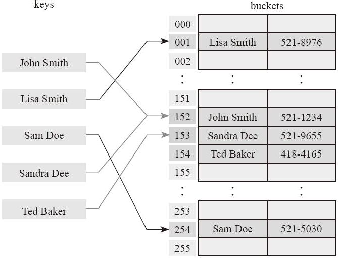

# 24.1 容器

跟 C++的 STL 类似，Rust 的标准库也给我们提供了一些比较常用的容器以及相关的迭代器。目前实现了的容器有：


下面选择几个常见的命令来讲解它们的用法及特点。

## 24.1.1 Vec

Vec 是最常用的一个容器，对应 C++里面的 vector。它就是一个可以自动扩展容量的动态数组。它重载了 Index 运算符，可以通过中括号取下标的形式访问内部成员。它还重载了 Deref/DerefMut 运算符，因此可以自动被解引用为数组切片。

常见用法示例如下：

---

```rust
fn main() {

    // 常见的几种构造 Vec 的方式
    // 1. new() 方法与 default() 方法一样，构造一个空的 Vec
    let v1 = Vec::<i32>::new();
    // 2. with_capacity() 方法可以预先分配一个较大空间，避免插入数据的时候动态扩容
    let v2 : Vec<String> = Vec::with_capacity(1000);
    // 3. 利用宏来初始化，语法跟数组初始化类似
    let v3 = vec![1,2,3];

    // 插入数据
    let mut v4 = Vec::new();
    // 多种插入数据的方式
    v4.push(1);
    v4.extend_from_slice(&[10,20,30,40,50]);
    v4.insert(2, 100);
    println!("capacity: {} length: {}", v4.capacity(), v4.len());

    // 访问数据
    // 调用 IndexMut 运算符，可以写入数据
    v4[5] = 5;
    let i = v4[5];
    println!("{}", i);
    // Index 运算符直接访问，如果越界则会造成 panic，而 get 方法不会，因为它返回一个 Option<T>
    if let Some(i) = v4.get(6) {
        println!("{}", i);
    }
    // Index 运算符支持使用各种 Range 作为索引
    let slice = &v4[4..];
    println!("{:?}", slice);
}
```

---

以上示例包含了 Vec 中最常见的一些操作，还有许多有用的方法，不方便在本书一一罗列，各位读者可以参考标准文档。

一个 Vec 中能存储的元素个数最多为`std::usize::MAX`个，超过了会发生 panic。因为它记录元素个数，用的就是 usize 类型。如果我们指定元素的类型是 0 大小的类型，那么，这个 Vec 根本不需要在堆上分配任何空间。另外，因为 Vec 里面存在一个指向堆上的指针，它永远是非空的状态，编译器可以据此做优化，使得`size_of::<Option<Vec<T>>>() == size_of::<Vec<T>>()`。示例如下：

---

```rust
struct ZeroSized{}

fn main() {
    let mut v = Vec::<ZeroSized>::new();
    println!("capacity:{} length:{}", v.capacity(), v.len());

    v.push(ZeroSized{});
    v.push(ZeroSized{});
    println!("capacity:{} length:{}", v.capacity(), v.len());

// p 永远指向 align_of::<ZeroSized>(),不需要调用 allocator
    let p = v.as_ptr();
    println!("ptr:{:p}", p);

    let size1 = std::mem::size_of::<Vec<i32>>();
    let size2 = std::mem::size_of::<Option<Vec<i32>>>();
    println!("size of Vec:{} size of option vec:{}", size1, size2);
}
```

---

编译执行，可得结果为：

---

```rust
capacity:18446744073709551615 length:0
capacity:18446744073709551615 length:2
ptr:0x1
size of Vec:24 size of option vec:24
```

---

将来类似 Vec 的这些容器，还会像 C++ 一样，支持一个新的泛型参数，允许用户自定义 allocator。这部分目前还没有定下来，因此就不深入讨论了。

#### 24.1.2 VecDeque

VecDeque 是一个双向队列。在它的头部或者尾部执行添加或者删除操作，都是效率很高的。它的用法和 Vec 非常相似，主要是多了`pop_front()` `push_front()`等方法。

基本用法示例如下：

---

```rust
use std::collections::VecDeque;

fn main() {
    let mut queue = VecDeque::with_capacity(64);
// 向尾部按顺序插入一堆数据
    for i in 1..10 {
        queue.push_back(i);
    }
// 从头部按顺序一个个取出来
    while let Some(i) = queue.pop_front() {
        println!("{}", i);
    }
}
```

---

## 24.1.3 HashMap

`HashMap<K，V，S>`是基于 hash 算法的存储一组键值对（key-value-pair）的容器。其中，泛型参数`K`是键的类型，`V`是值的类型，`S`是哈希算法的类型。`S`这个泛型参数有一个默认值，平时我们使用的时候不需要手动指定，如果有特殊需要，则可以自定义哈希算法。

hash 算法的关键是，将记录的存储地址和 key 之间建立一个确定的对应关系。这样，当想查找某条记录时，我们根据记录的 key，通过一次函数计算，就可以得到它的存储地址，进而快速判断这条记录是否存在、存储在哪里。因此，Rust 的 HashMap 要求，key 要满足 Eq+Hash 的约束。Eq trait 代表这个类型可以作相等比较，并且一定满足下列三个性质：

·自反性——对任意 a，满足 a==a；

·对称性——如果 a==b 成立，则 b==a 成立；

·传递性——如果 a==b 且 b==c 成立，则 a==c 成立。

而 Hash trait 更重要，它的定义如下：

---

```rust
trait Hash {
    fn hash<H: Hasher>(&self, state: &mut H);
    ...
}

trait Hasher {
    fn finish(&self) -> u64;
    fn write(&mut self, bytes: &[u8]);
    ...
}
```

---

如果一个类型，实现了 Hash，给定了一种哈希算法 Hasher，就能计算出一个 u64 类型的哈希值。这个哈希值就是 HashMap 中计算存储位置的关键。

一般来说，手动实现 Hash trait 的写法类似下面这样：

---

```rust
struct Person {
    first_name: String,
    last_name: String,
}

impl Hash for Person {
    fn hash<H: Hasher>(&self, state: &mut H) {
        self.first_name.hash(state);
        self.last_name.hash(state);
    }
}
```

---

这个 hash 方法基本上就是重复性的代码，因此编译器提供了自动 derive 来帮我们实现。下面这种写法才是平时见得最多的：

---

```rust
#[derive(Hash)]
struct Person {
    first_name: String,
    last_name: String,
}
```

---

一个完整的使用 HashMap 的示例如下：

---

```rust
use std::collections::HashMap;

#[derive(Hash, Eq, PartialEq, Debug)]
struct Person {
    first_name: String,
    last_name: String,
}

impl Person {
    fn new(first: &str, last: &str) -> Self {
        Person {
            first_name: first.to_string(),
            last_name: last.to_string(),
        }
    }
}
fn main() {
    let mut book = HashMap::new();
    book.insert(Person::new("John", "Smith"), "521-8976");
    book.insert(Person::new("Sandra", "Dee"), "521-9655");
    book.insert(Person::new("Ted", "Baker"), "418-4165");

    let p = Person::new("John", "Smith");

    // 查找键对应的值
    if let Some(phone) = book.get(&p) {
        println!("Phone number found: {}", phone);
    }

    // 删除
    book.remove(&p);

    // 查询是否存在
    println!("Find key: {}", book.contains_key(&p));
}
```

---

HashMap 的查找、插入、删除操作的平均时间复杂度都是 O(1)。在这个例子中，HashMap 内部的存储状态类似下图所示：



除了上面例子中演示的这些方法外，HashMap 还设计了一种叫作 entry 的系列 API。考虑这样的一种场景，我们需要先查看某个 key 是否存在，然后再做插入或删除操作。这种时候，如果我们用传统的 API，那么就需要执行两遍查找的操作：

---

```rust
if map.contains_key(key) { // 执行了一遍 hash 查找的工作
    map.insert(key, value);  // 又执行了一遍 hash 查找的工作
}
```

---

如果我们用 entry API，则可以提高效率，而且代码也更流畅：

---

```rust
map.entry(key).or_insert(value);
```

---

HashMap 也实现了迭代器，使我们可以直接遍历整个容器，这部分内容放到后面迭代器部分讲解。

HashMap 里面，key 存储的位置跟它本身的值密切相关，如果 key 本身变了，那么它存放的位置也需要相应变化。所以，HashMap 设计的各种 API 中，指向 key 的借用一般是只读借用，防止用户修改它。但是，只读借用并不能完全保证它不被修改，读者应该能想到，只读借用依然可以改变具备内部可变性特点的类型。下面这个示例演示了，如果我们动态修改了 HashMap 中的 key 值，会出现什么后果：

---

```rust
use std::hash::{Hash, Hasher};
use std::collections::HashMap;
use std::cell::Cell;

#[derive(Eq, PartialEq)]
struct BadKey {
    value: Cell<i32>
}

impl BadKey {
    fn new(v: i32) -> Self {
        BadKey { value: Cell::new(v) }
    }
}

impl Hash for BadKey {
    fn hash<H: Hasher>(&self, state: &mut H) {
        self.value.get().hash(state);
    }
}

fn main() {
    let mut map = HashMap::new();
    map.insert(BadKey::new(1), 100);
    map.insert(BadKey::new(2), 200);

    for key in map.keys() {
        key.value.set(key.value.get() * 2);
    }

    println!("Find key 1:{:?}", map.get(&BadKey::new(1)));
    println!("Find key 2:{:?}", map.get(&BadKey::new(2)));
    println!("Find key 4:{:?}", map.get(&BadKey::new(4)));
}
```

---

在上面的示例中，我们设计了一个具备内部可变性的类型作为 key。然后直接在容器内部把它的值改变，接下来继续做查找。可以看到，我们再也找不到这几个 key 了，不论是用修改前的 key 值，还是用修改后的 key 值，都找不到。这种错误属于逻辑错误，是编译器无法静态检查出来的。所有关联容器，比如 HashMap、HashSet、BTreeMap、BTreeSet 等都存在这样的情况，使用者需要自己避免。

标准库中的 HashSet 类型就不再展开讲解了，它跟 HashMap 非常类似，主要区别在于它只有 key 没有 value，从源码定义我们也可以看到：

---

```rust
struct HashSet<T, S = RandomState> {
    map: HashMap<T, (), S>,
}
```

---

## 24.1.4 BTreeMap

`BTreeMap<K，V>`是基于 B 树数据结构的存储一组键值对（key-value-pair）的容器。它跟 HashMap 的用途相似，但是内部存储的机制不同。B 树的每个节点包含多个连续存储的元素，以及多个子节点。B 树的结构如下图所示：


BTreeMap 对 key 的要求是满足 Ord 约束，即具备“全序”特征。前文中关于 Hash-Map 的示例也可以用 BTreeMap 重写，从中我们可以看到它的基本用法与 HashMap 很相似：

---

```rust
use std::collections::BTreeMap;

#[derive(Ord, PartialOrd, Eq, PartialEq, Debug)]
struct Person {
    first_name: String,
    last_name: String,
}

impl Person {
    fn new(first: &str, last: &str) -> Self {
        Person {
            first_name: first.to_string(),
            last_name: last.to_string(),
        }
    }
}
fn main() {
    let mut book = BTreeMap::new();
    book.insert(Person::new("John", "Smith"), "521-8976");
    book.insert(Person::new("Sandra", "Dee"), "521-9655");
    book.insert(Person::new("Ted", "Baker"), "418-4165");

    let p = Person::new("John", "Smith");

    // 查找键对应的值
    if let Some(phone) = book.get(&p) {
        println!("Phone number found: {}", phone);
    }

    // 删除
    book.remove(&p);

    // 查询是否存在
    println!("Find key: {}", book.contains_key(&p));
}
```

---

同样，BTreeMap 也实现了 entry API。BTreeMap 也实现了迭代器，同样可以直接遍历。但是 HashMap 在遍历的时候，是不保证遍历结果顺序的，而 BTreeMap 自动把数据排好序了，它遍历结果一定是按固定顺序的。

BTreeMap 比 HashMap 多的一项功能是，它不仅可以查询单个 key 的结果，还可以查询一个区间的结果，示例如下：

---

```rust
use std::collections::BTreeMap;

fn main() {
    let mut map = BTreeMap::new();
    map.insert(3, "a");
    map.insert(5, "b");
    map.insert(8, "c");
    for (k, v) in map.range(2..6) {
        println!("{} : {}", k, v);
    }
}
```

---

执行结果是：

---

```rust
3 : a
5 : b
```

---

当然，我们还可以使用其他的 Range 类型，如 RangeInclusive 等，在此就不赘述了。

对应的，标准库中的 BTreeSet 类型就不再展开讲解了，它跟 BTreeMap 非常类似，主要区别在于它只有 key 没有 value，从源码定义我们也可以看到：

---

```rust
struct BTreeSet<T> {
    map: BTreeMap<T, ()>,
}
```

---
